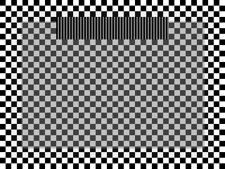
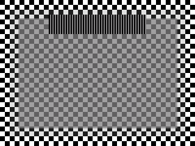

# 主桌面输入增量验证（2026-09-06/07）

本记录区分已完成的代码检查与尚未通过的持续实机验收。Windows 为 3840×2400、192 DPI，Linux owned HEADLESS-6 对应 scale 2、全局逻辑位置 (3072,390)，atlas 为 2048×2048。

## 已合入

- Windows 输入注入作用域临时启用 per-monitor v2 DPI awareness，度量与绝对指针注入使用同一物理坐标系，结束恢复线程状态。
- Linux 硬件输入通过既有认证连接转交 Windows；入口采用实际共边，返回须等待输入 ACK、撤销 ACK 和原生释放确认。
- Win 拖动对已消费 modifier 的重复、释放、焦点变化和取消进行完整处理。
- DWM blur 区域绑定及代理窗口暂停/复用；效果需要用户屏幕的最终确认。
- 已接纳窗口超出 atlas 时暂停发布并撤销旧输入授权，缩小可恢复。未实现动态 atlas 扩容。
- 输入发送期限预留 5.5ms（最大采样误差 4ms + 最长样本年龄 3s × 500ppm 漂移），保持接收端原有期限与原始硬件事件时间约束。

## 验证结果

Windows 原生 CTest 25 项通过。Windows 输入运行时 13 项、平台输入 19 项通过。Linux native-gpu 功能库 511 项通过、8 项设备相关项跳过。专项 cursor 8 项通过，包含合法时钟偏差使旧期限被拒绝的复现与收紧后的验证。

部署前一次真实 uinput 鼠标测试完成进入、Windows applied ACK、移动与返回；返回 Hyprland 坐标 (2922,609) 与 native return receipt 一致。该结果只证明短时鼠标往返，不证明键盘、Win 拖动、所有帧或持续运行。

随后真实输入触发 `RejectedInvalidInput`。没有故障阶段诊断，不能断言只有时钟误差一个原因。新增期限收紧及失败阶段日志后，两端重新构建部署。

新部署两次在启动最初数帧退出，表现为 disposition receipt deadline expired；第三次达到 282 次原生视觉提交后以 `atlas pointer queue unavailable` 退出。尚未通过稳定性复测。原生视觉提交计数不是物理显示完成收据。

本地证据文件：`/tmp/viewflow-horizon-merged-tests.log`、`/tmp/viewflow-horizon-windows-build.log`、`/tmp/viewflow-horizon-failure3-source.log`、`/tmp/viewflow-horizon-failure3-windows.log`。这些是当前机器的临时日志，不作为仓库内可复现材料的替代。

该轮 Windows Rust 接收器 SHA256：`743e6c37a22ab6eca035531172912385273fe39caadf3248741422384cbda194`。原生接收器：`b3977258a71f4814fa708a94a06d66769dfE51e237ba204d9bd6e55f6ca5708c`（大小写无语义差异）。后续修复应重新记录构建哈希与实际结果。

## 授权启动死锁修复后的进展

已确认并修复：源端等待第一次 selection 再发授权，接收端却在没有初始授权时不读取 selection，最终填满 64 项原生输入队列。接收端现在在来源就绪且时钟可用后允许第一选择；应用输入仍须明确授权。回归测试证明修复前超时、修复后成功，相关 23 项测试通过。队列容量保持不变，Full 与 Closed 错误已区分。

Windows 原生错误记录改为析构前一次写出 stage/frame/HRESULT/message；同时移除 disposition 模式的重复 admission deadline 检查，保留未绑定过期丢弃与最终绑定/提交期限。

更新后的单测试窗口会话完成 2502 次视觉提交；真实测试鼠标成功进入 Windows，源端授权计数达到 1，未再停在初次选择死锁。但点击仍因 awaiting selection 超期而结束会话，测试窗口没有收到按钮事件，未执行后续键盘与 Win 拖动。源端捕获帧年龄约 41.9ms，超过原 33.3ms 上限；此处没有放宽期限。

该轮部署 Windows 接收器 SHA256 为 `c40535937348790ce850f9a21ec87a4344799ce379ff16712fd142e2a5fbd00d`，原生预览为 `09c35937c18de202c955ca426625f642e4009196e98d2c194f81e3ba0c251594`。对应失败证据 `/tmp/viewflow-bootstrap-failure3-source.log` 和 `/tmp/viewflow-bootstrap-failure3-windows.log`。

## Blur 实际 atlas 路径验证

独立 Windows 交互任务创建自有 320×240 棋盘背景，实际 atlas 协议经过3个warmup后在原33.333ms QPC期限内提交前景；分别设置 sigma 0 与 12，仅截取自有区域。两次提交余量约29.7–30.0ms，退出码0。本验证不是 legacy 矩形诊断路径，也不替代持续混合输入验收。

半透明内区亮度标准差由63.50降至31.50，取值范围由64–192收窄至96–160，背景高频对比降低约50%。完全透明外沿的最大像素差为0，不透明前景条纹的最大像素差也为0。说明仅背景产生模糊，前景文字/条纹保持清晰、透明边角不覆盖背景。低alpha阴影仍按alpha权重混合模糊；未引入源端精确blur区域元数据。

| 关闭模糊（sigma 0） | 开启模糊（sigma 12） |
| --- | --- |
|  |  |

## V9 恢复与输入法会话诊断（进行中）

新增双向协商的 selection rejection 消息和原生 V9 Cancel/Resume：源端确认撤销后才返回拒绝；接收端丢弃旧事件，等物理按键释放，再选择新画面取得新授权。旧按钮不补发，捕获帧 33.333ms 上限和硬件事件期限不变。恢复控制必须使用真正已提交的帧；过期但未绑定的帧只推进解码序号，不能充当画面依据。V9 恢复也不能清除下一帧必须为双关键帧的要求。该管道专项 19 项测试通过。

原生 Linux BEGIN 新诊断在实机报告 `begin_stage=8, keyboard_startup_failure=327681`，对应此前窗口仍持有输入法 grab。切换到自有无文本输入测试窗口后 BEGIN 成功；正在实现明确焦点切换与有界等待，不能绕过输入法 grab 或修改用户输入法设置。

随后接收端出现 `fresh rejection recovery authorization expired`：恢复暂停期间没有继续读取同一可靠通道上的源端新授权，导致等待循环。该修复与实机复测仍在进行。

测试工具已补充每次按下前和事件记录后的源进程存活校验。一轮手动预聚焦后日志虽记录按钮和 A 键事件，但源连接已中断、原生窗口通道没有对应注入记录，因此这些可能是恢复到本地后的事件，明确不计入远端点击或键盘成功证据。Win 拖动未通过。当前不能宣称持续输入可用。

对应临时证据：`/tmp/viewflow-recovery-gap-tests.log`、`/tmp/viewflow-recovery-gap-fixture-live.log`、`/tmp/viewflow-recovery-gap-focused-fixture-live2.log`、`/tmp/viewflow-recovery-gap-focused-windows.log`。

## 用户手动验收版本（2026-09-07）

用户明确要求后续实机操作由本人完成；此后没有执行自动鼠标或键盘测试。自动测试窗口已关闭，原 Dolphin/auto-enroll 配置已恢复。新版本已部署并启动主会话；启动确认不等于交互验收通过。

本版加入精确源端 Wayland IME 按键派发、可信 IME 虚拟键盘返回及原始接收者清理。按键仍是物理 HID，代理不生成组合文字；原生确认只证明发给源应用/IME，不证明异步文字提交。当前输入法候选框按精确 TextInput/IME owner 纳入源窗口捕获；候选框在原主 surface 范围内可命中，超出该范围的部分暂只显示，不能点击。XWayland IME popup 尚未覆盖。

Windows 代理焦点内的按键统一走保留原始时间的 FIFO，包含 Win+Space；普通窗口键盘消息不重复派发。Win+左键拖动先以原鼠标时间发明确的 Win 释放，既有 FIFO/源确认门槛通过后开始移窗。先松 Win、后松鼠标的取消路径保留物理尾事件，不将孤立 mouse-up 转给应用。

检查：Rust native-gpu 库538通过、8跳过；Linux 输入插件9/9；捕获插件7/7；Windows原生25/25。均不替代用户手动输入法、拖动与稳定性验收。

部署SHA-256：Linux源程序 `d335ecffb2671ca0cfc1b47099b207cfbf41b322802b736f4fdeaaa7a2da58de`；Linux输入插件 `6f98bc3a189828cc80b1d699f1950fc5fd7bd1455c864036e7f23df63a491a63`；Linux捕获插件 `2e3232a84229898ce63544a1146732a67a1630e41fe250a293ac4d240efa8707`；Windows Rust `b66c0114477d8ccc9204851831b86feca17dccfbe02bd71f4122d511786a9627`；Windows原生 `05bcad218775e0cc6626e9c3cfb3be15e2ff690674ae89e3f32f22b21399733a`。

启动日志仍有其他Dolphin候选超出2048×2048 atlas容量的记录；该候选未加入，未关闭用户窗口。已加入Dolphin的画面也仍有干净过期丢帧，持续时限稳定性未通过。临时日志 `/tmp/viewflow-manual-handoff-deploy.log`、`/tmp/viewflow-manual-handoff-rust-tests.log`、`/tmp/viewflow-source-ime-windows-native-final-build.log`；实时主会话日志 `/run/user/1000/viewflow/desktop-drag/source.log`。

## 手动反馈：无法跨屏

用户反馈无法跨屏。只读检查确认连接与媒体仍运行，但 owned HEADLESS-6 已被捕获插件加载引发的配置重载重置为1920×1080、scale2、位置(4448,0)，不再与本地主屏相邻。部署辅助脚本原本在最后一次插件加载之前设置布局，这是本次漏检。现将布局恢复/读回放在所有插件加载之后，并在启动前再次核对实际尺寸、位置、缩放和monitor ID。

恢复正确3840×2400、scale2、位置(3072,390)后，用户实际操作产生 `native-active` 和 `initial-windows-applied`，证明入口已被触发；没有自动移动鼠标或注入输入。随后首次悬停选择触发捕获过期恢复，Windows V9 Resume 因 `atlas recovery target lacks foreground focus` 退出。该悬停前台门槛正在修复；末尾 cursor applied ACK超时是接收器退出后的结果，不能单独归因为网络慢。

保留日志 `/tmp/viewflow-manual-crossing-source.log` 与 `/tmp/viewflow-manual-crossing-windows.log`。

悬停恢复门槛已修复并经过 Windows 原生25/25检查：仅可见、未发生激活输入、物理按键已释放的V9悬停恢复可在未聚焦代理上继续；V6和键盘焦点检查保持不变。部署后原生接收器SHA-256为 `8c557b33d1d96ce377ba33bdc6d08c4931a84dbf03136a3b56d7f99718d2ca0c`。

随后用户手动跨屏再次触发退出：`selection rejection does not name an unforwarded event`。接收端对新selection复用了上一轮精确帧授权，提前转发并清空等待记录，稍后的拒绝因此无法匹配。仅等待任意新授权仍不充分，因为源端后台续期也会产生授权，且原授权watch可合并更新。正在加入与精确selection关联的成功收据，并串行确认源端原生安装；两端必须同时更新。该轮日志 `/tmp/viewflow-hover-resume-manual-source.log`、`/tmp/viewflow-hover-resume-manual-windows.log`。主会话已退出，不能将构建通过作为当前可用证据。用户手动测试要求继续有效。

## 跨屏选择收据修复已部署（2026-09-07）

加入精确的 AtlasWindowSelectionAccepted（控制消息46），携带原selection和原生确认安装的授权；源端以独立队列串行完成后再允许后台续期，接收端只有该精确响应才能放行本次事件。旧授权、普通续期与晚到拒绝不会提前清空本次等待记录。晚到成功响应会丢弃已过期的鼠标移动；原输入期限不延长。晚到成功的按键/按钮若缺乏END清理证明，仍可能安全终止会话，尚未解决长期混合输入稳定性。两端需要同时更新。

检查：Linux原生功能库542通过、8跳过；高并发初跑有一项既有时钟测试超时，隔离复查及2线程完整重跑通过。Windows接收端选择14、协议3、输入运行时14、平台输入19均通过。原生接收器保持上一轮25/25通过的悬停恢复版。测试不包含用户实机操作。

部署SHA-256：Linux源程序 `e8e41ef339f57e2c15d437383903b8015e754278b9226c88ac6e06b0f6be65c6`；Windows Rust `e01ccb3641b4ebb534d868719fa66e5c91bf24af4572feaffbbba99a5e7be2ea`；Windows原生 `8c557b33d1d96ce377ba33bdc6d08c4931a84dbf03136a3b56d7f99718d2ca0c`。输入/捕获插件保持前一版。恢复并核对HEADLESS-6物理3840×2400、scale2、位置(3072,390)、ID2。主会话启动，源PID3960156读回存活，媒体反馈和时钟探测正常；没有自动移动鼠标、聚焦或注入按键。跨屏操作待用户手动复测。

临时证据：`/tmp/viewflow-selection-receipt-deploy.log`、`/tmp/viewflow-selection-receipt-windows-build.log`、`/tmp/viewflow-selection-receipt-merged-tests-low-concurrency.log`。

### 用户反馈：一碰就消失

上述部署再次被用户手动操作触发退出。源端明确报告 `native window authorization revoked: generation=2 reason=FocusChanged`；此轮authorized=3，capture_discarded=0、timing_discarded=0。Windows日志仅显示源端关闭连接，不能归因接收器自身崩溃。原生环形诊断BEGIN seq3/type59/stage9成功，首次记录motion seq4/type51/result2，事件尚有约28.5ms期限，故不是此次事件过期。首motion同步焦点设置失败与既有焦点被重检查改变，旧诊断不足以区分，正在补充精确诊断并排查。已停止的源PID3960156不再代表运行中。手动测试约束不变。保留 `/tmp/viewflow-touch-disappear-source.log` 和 `/tmp/viewflow-touch-disappear-windows.log`。

静止光标重检查路径已窄修：仅session仍live、已开始、精确owned pointer仍等于seat current且global位置不变时取消compositor重检查；真实本地输入及第三方focus接管仍撤权。新pointer_focus_diagnostic环形字段保留第一次失败的phase和seat/mouse/dnd/owned/current/keyboard/button状态。9/9原生测试通过，输入插件SHA-256 `35ce5bf9f56a4f2e1f0bb761c550416b62e97554cd03e3077fd59b15a2096f9d`。已部署并启动源PID4015983，实际布局读回正确，媒体与时钟恢复。未执行自动输入；这项代码修复尚不证明本次实机故障已消除，等待用户一次手动触碰。部署日志 `/tmp/viewflow-focus-diagnostic-deploy.log`。

### 再次手动触碰失败

用户再次反馈“一碰就消失”。本次源端为 `RouteUnavailable`，不是前次FocusChanged；新增focus诊断字段为空。源端authorized=2，capture/timing discard均0；gen2 BEGIN seq3 stage9成功，seq4 motion result2，仍有约22ms原事件期限。Windows同样是源端关闭连接。保留 `/tmp/viewflow-touch-second-source.log`、`/tmp/viewflow-touch-second-windows.log`。被动设备检查当前main键盘为 `hl-virtual-keyboard-fcitx5`。代码检查发现exactBinding把IME停用后保留的当前虚拟键盘视为不兼容，可能导致所有mouse输入的共享键盘session失效；正在区分设备兼容与实际IME按键派发权限，并添加运行期键盘失效诊断。源PID4015983已结束；不把上轮部署当作稳定可用。

### 悬停激活闪烁与延迟退出：结构性修复中

后续两次启动分别源PID4072010、4107874，均在最终存活检查前退出，不能作为当前运行状态。用户明确补充：一轮是碰到后几秒退出；在窗口周围移动时可见激活/不激活反复切换。原生检查确认静态allow_keyboard让每次hover BEGIN聚焦目标，而CaptureExpired END又恢复previous，这正是反复激活路径。正在改为selection明确携带键盘激活意图，普通悬停只申请指针，点击/实际键盘事件才升级；临时清理保留焦点但仍释放所有按键按钮与撤销许可。

4072010的最后诊断0x50010000为seat keyboard focus mismatch，registered IME过渡及首次指针前保护已更新；随后也加入同轮null→原surface焦点通知的严格暂停/idle复核（期间禁止输入）。4107874不再是FocusChanged/RouteUnavailable退出，而Windows明确拒绝过期desktop-position gen2seq708，mapped_horizon=-3.601ms；源端将游标ACK错误升级为关闭整个连接。正在改为确认远端cleanup后释放本地捕获，保留媒体连接；仍不延长事件期限或补发旧事件。日志 `/tmp/viewflow-focus-reentry-live-source.log`、`/tmp/viewflow-focus-reentry-live-windows.log`。

当前会话停止，待上述变更构建检查后再启动；实机操作继续仅由用户执行。

## 悬停/激活分离与游标回退版本已部署

AtlasWindowSelection新增activate_keyboard；鼠标悬停不请求键盘激活，显式button-down或已聚焦原生键盘事件且本地允许keyboard时才请求。源端hover使用pointer-only BEGIN；激活升级经新generation、已确认END_PRESERVE_FOCUS(type62)再BEGIN59原生/IME就绪后返回精确接受收据，原事件期限不变。同窗口已激活状态保留；跨窗口hover降回指针，不抢键盘focus。临时拒绝清理使用62，仍释放buttons/keys并撤销许可，只不恢复旧焦点。普通END52不变。

游标ACK失败或已过期排队事件停止转发，原inflight在原期限内终结；新独立cleanup先确认Windows lease revoke，再确认本地native release。确认成功保留媒体连接并要求下一次真实边缘进入；清理不确定仍结束连接，不补发事件/不放宽期限。已确认END的paused状态只在精确pendingRelease证明下接受对应Cancelled通知，仍等待capture receipt。

验证：Linux native-gpu库548通过、8跳过；Windows选择14、协议3、输入运行时14、平台19通过；游标专项12、原生9、私有wire7通过。高层新增测试状态复用问题已隔离修正后完整通过。首次启动frame4触发native commit exceeded deadline，重启后源PID55909，最终检查alive=False；启动成功不等于实机验收。首次失败日志 `/tmp/viewflow-hover-activation-startup-windows.log`。没有自动输入或焦点测试。

SHA-256：Linux `31e333e9cb813d55483ab588f0915f79c1927a7b21be0e3db37e17f06b076dbe`；input `4e0b2e57116576af110e211fb4988c90e1792f51b41fcf180d5830b954949454`；WindowsRust `AD1DB8238BB012BF042DD240364A5E5796718EBBCBA755DDF1081F2542CF58CC`；Windowsnative `8C557B33D1D96CE377BA33BDC6D08C4931A84DBF03136A3B56D7F99718D2CA0C`。部署 `/tmp/viewflow-hover-activation-deploy.log`；全套检查 `/tmp/viewflow-hover-activation-merged-tests.log`；Windows检查 `/tmp/viewflow-hover-activation-windows-build.log`。当前待用户仅悬停/边缘移动复测。

## Linux跨屏专用路径后续修复已部署

用户明确Windows本地鼠标悬停正常、Linux跨屏鼠标触发问题。已将同一认证连接内的游标InputLease/Event/Revoke拆为独立有界FIFO actor，仍同一reader/writer，避免preview recovery fence等待阻塞SendInput/ACK。无事件合并、补发或期限放宽；溢出/owner错误/清理不确定仍关闭。作用域内future同时监管，退出同步清理输入。

恢复selection超过原24ms后保留精确响应关联至额外100ms终结界限；精确NACK保留原native Cancel/drain证明，只解除媒体fence并等严格更新的atlas/source frame再发新selection。旧应用事件始终销毁，late acceptance只允许精确native Resume。

完整native-gpu测试快照551通过、8跳过；另新增cursor actor4/4（模拟后端）、preview14/14通过。Windows构建及选择14、协议3、输入14、平台19通过。部署日志 /tmp/viewflow-cursor-actor-deploy.log；测试 /tmp/viewflow-cursor-actor-merged-tests.log、/tmp/viewflow-cursor-actor-windows-build.log。源启动PID145977，尚待用户手动验证；未自动输入。SHA256 Linux=d6c54754cc980316ddb4c8b4e7f496685a2aff4736e12dc7bf705bf0f35dc720；input=4e0b2e57116576af110e211fb4988c90e1792f51b41fcf180d5830b954949454；Windows=['33FBCE320431F1F7B9149E405E11F2563968ACF62B060690307F717DE0F575AB', '8C557B33D1D96CE377BA33BDC6D08C4931A84DBF03136A3B56D7F99718D2CA0C']。

## 2026-09-07 用户修正安全与性能指导原则

用户明确：安全限制不应比 Windows remote window、Sunshine/Moonlight 更严格；33ms只是性能目标，不是退出条件。已写入根AGENTS.md及security-and-availability-policy.md，优先于上文历史要求。

上一版输入插件加入sendMotionEventsToFocused的受限hook与被动调用来源记录，已加载后启动源PID247419。该运行后来仍退出，不能记为成功：Windows实际根因为 `atlas input recovery does not match newest committed tile`，源端cursor-owner-closed只是连接关闭的伴随信息；源端20次capture rejection，最后画面年龄52.72ms对33.33ms阈值。保留 `/tmp/viewflow-focused-motion-hook-live-source.log`。这验证了不能只把安全/时限拒绝继续补成更复杂的终止链。

本次修改：原生已开始的视觉更新不再因错过33ms中断；提交保留实际时间，Rust明确区分CommittedLate并保持参考帧链。未写入/未绑定的过期帧仍可丢弃。发送与原生handoff分离为5秒无响应看门狗，不再拿帧目标中断部分写入。画面等待超时保持连接；源端无新帧只记录。生产输入策略不再以画面年龄触发CaptureExpired，仍检查真实目标/几何/成员。无按钮和键盘会话的hover允许下一次真实motion重新进入精确目标；不在空闲时自动恢复焦点。已有strict hook与被动trace保留。

验证：Linux native-gpu库555通过、8跳过；其中增加迟到提交后继续下一非关键帧、画面年龄超目标仍可进入后续授权检查的回归；原生插件9/9；Windows原生25/25；Windows Rust输入14、平台19通过。两端release成功。此处测试不等于真实持续输入验收。

已部署哈希：Linux `86e240d1ad48628d81b5a4b1482ada79f9e3c9b200e7781045d1e95e039450b0`；input `ae4e423c1284eb4211f06deff084af813d7d8cb5e146dcfe0f4d81b453d095b0`；WindowsRust `4F9B82A00E8F7909C67E80469C5550F0D80FD56B768F2FFB04AA2CA7AB17B4CD`；Windowsnative `D36B0640632DC2E0C1D1E9E120E616EC849F4A1D037308AAA7EE8CF80CA24B41`。部署日志 `/tmp/viewflow-soft-target-deploy.log`；测试/构建 `/tmp/viewflow-soft-target-tests.log`、`/tmp/viewflow-soft-target-windows-native.log`、`/tmp/viewflow-soft-target-windows-rust.log`、`/tmp/viewflow-soft-target-linux-release.log`。

仍有整改差距：旧输入事件自身期限、恢复握手期限、恢复布局变化及部分原生路由故障仍可能传播为会话退出。本轮不宣称已全面达到新原则；这不是允许保留旧限制的例外。所有实机输入由用户手动进行，本轮没有工具注入鼠标、键盘或测试性聚焦。

本次启动源PID329268，最终检查alive=True，布局读回3840×2400、scale2、(3072,390)、ID2；媒体提交与probe3已观察到，持续手动操作仍未验收。

## 2026-09-07 恢复通知与画面发布交错修复

用户报告上一运行死亡，已取两端原始日志：源PID329268已结束；Windows首因 `atlas recovery cancellation does not name a committed tile`，之后才关闭媒体和源端连接。10440次原生提交，源端capture_discarded=0、timing_discarded=0。保留 `/tmp/viewflow-soft-target-last-death-source.log` 与 `/tmp/viewflow-soft-target-last-death-windows.log`。

按用户“修”修改AtlasPreviewInput：取消通知是本机原生输入状态观察，不是新的输入许可，不再要求其帧号等于异步watch的最新帧或仍在32帧历史里。等待物理按键释放时继续媒体、不开始源授权倒计时；收到对应drain后才阻止下一帧进入，等待正在提交的帧完成，再重新读取已发布布局，为当前目标生成一次新的source selection。恢复控制使用该选择的最新帧/几何，旧通知仅用于关联原取消。源授权的帧与原生通知的旧帧不再强制相等，授权generation仍作为后续源端清理的下界。允许同窗口layout/placement向前推进，重复drain不重复申请。普通输入不会在恢复期间补发。

新增回归分别模拟通知早于画面发布、通知已从历史淘汰、源端授权发布滞后；持有媒体提交锁时恢复必须等待，提交完成后选择更新的帧150/source69/geometry9；确认恢复请求实际使用这些新身份、旧epoch7仍正确关联，并完成收据后退出恢复状态。完整Linux native-gpu库556通过、8跳过（随后仅删除未使用的旧比较函数）。本轮未修改Windows原生或输入插件，也未自动注入鼠标/键盘。

构建/测试日志：`/tmp/viewflow-recovery-frame-all-tests.log`、`/tmp/viewflow-recovery-frame-windows-build.log`、`/tmp/viewflow-recovery-frame-linux-build.log`。持续手动输入效果仍需用户验证，不能据此宣布所有旧终止路径已移除。

本次两端Release构建通过；Windows Rust输入14、平台19通过。已部署 `/tmp/viewflow-recovery-frame-deploy.log`。SHA256：Linux `30c0bd40f7acfe88c1d6d096222822c6c22899e0da523b8445d0adb379b21911`；WindowsRust `301E760D7FED4814A3CE3051CEAAC7BAC5B37E26117DA250CC05EB692BAF5C06`；输入插件仍 `ae4e423c1284eb4211f06deff084af813d7d8cb5e146dcfe0f4d81b453d095b0`；Windows原生仍 `D36B0640632DC2E0C1D1E9E120E616EC849F4A1D037308AAA7EE8CF80CA24B41`。布局重新读回正确。

恢复启动源PID457837，最终检查alive=True，probe3和媒体提交已观察到；未自动输入，待用户手动验收本次修复。

## 2026-09-07 edgehover交接与迟到鼠标移动

用户反馈源PID457837运行时DP与Windows Dolphin焦点跳动、随后退出，并明确允许修改更新edgehover。两端日志保存 `/tmp/viewflow-recovery-focus-death-source.log`、`/tmp/viewflow-recovery-focus-death-windows.log`，原生环形记录 `/tmp/viewflow-recovery-focus-native-timings.json`。8047次媒体提交后由Linux源端 `native window command rejected: Rejected` 退出；Windows随后收连接关闭。最后native seq186/type51/motion，received97838156413403对deadline97838156227952，晚185451ns，result0。此前motion均result2（成功）。无本次geometry恢复日志。

焦点调用来源已确认：CSeatManager::setPointerFocus ← hypr_edgehover::EdgeHover::deliverSyntheticMotion ← handleMouseMove ← mouseMoveUnified ← onMouseMoved。edgehover虽检查cancelled，但它先于Viewflow监听器运行，已向本地目标发送移动甚至FFM聚焦。故需协调捕获所有权，不能仅在Viewflow末尾取消。

实现：Viewflow输入插件导出可选只读 `viewflow_input_capture_active_v1`；edgehover移动、按钮、滚轮处理先查询已加载Viewflow句柄，捕获期间清除其synthetic/sticky状态并cancel事件，返回本地后自动恢复原功能。每次按当前handle解析，不缓存卸载后的函数指针。未添加新mouseMoveUnified hook（曾拟议但最终删除）；旧focusedMotion hook保留。

普通motion原生Rejected现在恢复Ready并返回准确Rejected ACK，允许下一新motion，不撤销整个会话；Windows对匹配的普通motion允许迟到ACK，等待回执采用独立5秒无响应看门狗，不把原33ms事件期限作为退出条件；原事件不补发。按钮/滚轮/键盘的旧确认策略此次未扩展。原生move在focus listener之后仅事件过期时丢弃该motion，不结束仍有效的window session。

测试：Linux完整native-gpu库558通过、8跳过，新增native拒绝后下一motion仍成功、迟到拒绝ACK后继续新motion；plugin9/9；edgehover geometry1/1；两端Rustrelease与Windows输入14/平台19通过。日志 `/tmp/viewflow-edgehover-compat-all-tests.log`、`/tmp/viewflow-edgehover-compat-native-build.log`、`/tmp/viewflow-edgehover-build.log`、`/tmp/viewflow-edgehover-compat-linux-build.log`、`/tmp/viewflow-edgehover-compat-windows-build.log`。edgehover交接需用户真实操作验证，无自动鼠标/键盘/聚焦。

edgehover根拥有的hyprpm缓存不能免密更新（sudo -n需密码），因此部署用户本地 `/home/wilf/.local/lib/hyprland/hypr-edgehover-viewflow.so`，新增 `/home/wilf/.local/bin/hypr-edgehover-local`；既有hyprland-exec-once.lua在hyprpm reload后运行该loader再reload配置，原文件已备份，Lua语法检查及live configerrors均通过。当前maps确认仅加载本地新版edgehover。手动hyprpm reload后须再运行loader以保留本地版本；缓存原件未改。

部署 `/tmp/viewflow-edgehover-compat-deploy.log`。SHA256 Linux `cb1d23749107380255f44cf74ce6ffb9d24165039a8a3b06a7d70a41fffff21e`；input `79232f41a50840f4a60599ee5fc8d57d6774b26892fb7a03b98b3855d5230b5a`；edgehover `41f2bbd6d0a9252ab05476a75969c1de00d75b4e1bfbedbe167c2bd233673f06`；WindowsRust `EF94C664A79F2AC5DF0A54D22980642CC87DBB6301B1D85662AEB9A21800EE2E`；Windowsnative仍 `D36B0640632DC2E0C1D1E9E120E616EC849F4A1D037308AAA7EE8CF80CA24B41`。

edgehover compatibility committed in /home/wilf/data/hyprland_plugins/hypr-edgehover as `fdc9b40` (`fix: cooperate with Viewflow remote input capture`); working tree clean after commit. hyprpm registered repository is this local path, so future updates can build the committed fix. The root-owned hyprpm cache was not rebuilt in this step; the previously loaded user-local plugin remains the deployment path.

## 2026-09-07 点击反馈后的捕获取消恢复修复

用户确认悬停正常，点击后会话退出。源端首因 selection acceptance failed: native window command rejected: Rejected；Windows仅收到源端window dispatcher ended。723次原生媒体提交，capture/timing discarded均0。native最后seq301/gen9/type58，begin_stage2，剩余约4.998秒，非事件过期。此前发生cursor rollback native-event-expired并成功释放捕获；其Cancelled将Rust标为DesktopPaused，但不是END收据。下一selection直接BEGIN，原生authority仍revoked而拒绝。日志保留/tmp/viewflow-click-death-{source,windows}.log及/tmp/viewflow-click-native-timings.json。

修复：已激活过且缺当前generation END收据的DesktopPaused恢复，先发END_PRESERVE_FOCUS，收到Ended才发新BEGIN；初次未激活及已有END收据的路径不增加重复END。原生精确END完成且cleanup成功后清除revoked/resize状态，保留generation floor；不同generation或cleanup失败不解锁。普通BEGIN不能单独清除撤权。取消捕获后同连接恢复不再依赖新physical edge。

回归覆盖capture release后keyboard activation及local motion revoke后同连接END→BEGIN，Linux558通过、8跳过；原生9/9通过。首次测试使用错误feature名已更正，随后测试中模拟回包序号和旧状态断言已更新，最终全套通过。日志/tmp/viewflow-click-tests.log和/tmp/viewflow-click-native-build.log。用户实机输入仍仅本人执行；不代表其他输入路径已验收。

部署完成 /tmp/viewflow-click-deploy.log，Linux release成功，Windows接收端保持上一版。SHA256 {'target/release/vf-media-peer': '08d2165645a328eef24e3bc2952579269dd49cbc0e596da5684dc475de920e08', 'build/desktop/input/viewflow-hyprland.so': '2c89f43f050371d563ec6751f73854e40c58b07a46ba49f15f51b35cddcb7578'}。本次源PID666915，最终读回alive=False。未注入鼠标/键盘，等待用户点击复测。

### Win+拖动后的第二次退出

上述PID666915启动后实际已结束，不能记为运行成功。最后seq360 END62/gen6成功，seq361 BEGIN58/gen7 stage9成功，证实上一轮恢复通道修复已走通。新首因为native LocalButton撤权撞上Moving（已发seq362），旧Rust只容许Ready下本地接管，故关闭整个流。此前cursor native-event-expired回退已释放捕获，实际按钮变成本地输入。保存/tmp/viewflow-click-second-source.log及/tmp/viewflow-click-second-native.json。用户补充Win+拖动退出并弹开始菜单，并明确修正菜单本来就是松开发，怀疑断连释放所致；没有修改开始菜单触发方式。

新增处理：Moving中的本地接管保留原命令关联，等待精确MotionSent/Rejected，再转DesktopPaused；后续同连接经确认END重新选择。过期native motion仍校验lease/序号并积分坐标，丢弃该样本而不释放捕获；按钮/键盘和其余ACK超时旧策略尚未全部整改。Windows StatefulInput仅在ReleaseAll/Drop等强制清理左右Win时注入无分配VK0xE8遮蔽键再释放Win，正常apply_key松开路径不变；遮蔽使用现有preview replay tag绕过source键盘转发，部分SendInput失败补清遮蔽键并保留原Win的待清理状态。0xE8定义见 https://learn.microsoft.com/en-us/windows/win32/inputdev/virtual-key-codes 。这一策略仍待用户实机确认，无工具注入输入。

Linux native-gpu-nvenc测试/tmp/viewflow-win-drag-tests.log；本地Windows平台模拟17通过，Windows平台20通过/tmp/viewflow-win-drag-windows-build.log；两端release构建成功。新增真实Unixsocket回归LocalButton插入pending motion，拒绝ACK后保持连接并END→BEGIN恢复；首次测试缺Tokio运行时，改异步fixture后复测。新测试也确认正常Win release不调用强制取消路径。

最终559通过、8跳过；部署/tmp/viewflow-win-drag-deploy.log成功。Linux SHA256 0e7e07bc2a3193a4a1dbb62d6787e2da43446ff46657c08bc442a7cd1ac813b0。源PID756421 最终alive=True；实机Win+拖动与开始菜单清理效果等待用户验证。

## 2026-09-07 点击瞬间鼠标退回本地

用户反馈点击鼠标被带回屏幕。源756421后来已死；日志三次native-event-expired触发rollback gen2→3、5→6、8→9，最后keyboard event not admitted退出。保留/tmp/viewflow-click-return-source.log。此前只对过期motion做丢弃，click/key仍使用33ms本地队列期限并触发Release捕获，这就是主动warp回本地的直接路径。

将cursor操作看门狗与motion性能目标分开：motion仍33ms过期可积分坐标后丢弃，click/key/control使用原事件时间起5秒操作界限；发送与ACK也在这个独立操作界限内完成，迟到且精确RejectedExpired的纯motionACK终结为丢弃，不释放capture、不重放。真实操作超时仍走现有receiver/native清理。input_runtime允许5秒operation horizon而非把33ms当最大输入期限，仍保持时钟映射、序号/目标/配对及有效期检查。native事件年龄上限同步5秒。其余window-preview旧时间/焦点限制并未在此全部改完。

新回归模拟80ms延迟click仍可入场，以及40ms后收到Applied click或RejectedExpired motion仍正常终结；Linux560通过8跳过/tmp/viewflow-click-capture-tests.log，Windows输入14通过/tmp/viewflow-click-capture-windows-build.log；两个旧测试对33ms硬边界的断言改为5秒操作边界，最终全套通过。两端release构建，/tmp/viewflow-click-capture-linux-build.log。

用户随后明确要求这条严重延迟退出限制设为5000ms；本轮INPUT_OPERATION_TIMEOUT_NS为5_000_000_000，与该要求一致。

已部署/tmp/viewflow-click-capture-deploy.log；Linux SHA256 0615ecc47508b1478c74206ea2b43aa4d6e2a6f48311f505b0260ab5abc76a41。源PID820896，最终alive=False。用户点击实机效果待验证。

5000ms版本源820896启动后仍退出，最终alive=False。此轮已不再观察到native-event-expired回退，记录为真实越界return-complete；新失败selection acceptance failed: window grant expired。旧grant已结束/取消，下一selection发END等待清理时poll仍按旧expires结束连接。现将SwitchingEnd/DesktopEnding排除旧grantexpiry gate；同generation原生撤权通知在已发END状态等待精确END结果，不把它当新许可、也不放行应用输入。测试加入旧expires=0及native Expired通知插入END前，仍完成END→新BEGIN。Linux560通过8跳过/tmp/viewflow-expired-end-tests.log，release/tmp/viewflow-expired-end-linux-build.log。源日志/tmp/viewflow-click-grant-source.log，native/tmp/viewflow-click-grant-native.json。

最终部署/tmp/viewflow-expired-end-deploy.log成功。Linux SHA256 ce99f691001c6cb2b9f617d3195844a284ed5a37370e687cb1d81a15939fb7ae；源PID848483 启动后立即核对alive=False。用户实机点击待验证。

用户明确旧Dolphin卡死后已关闭，要求将WS1新Dolphin加入白名单。只读probe新窗口address0x560286ab0a00 PID2555632 stable180000ba尺寸1564x1296。运行config及持久send.json已备份并更新candidates/windows，logicalID957d3bac55a69af1faadd9ab7b80a14f。未移动/聚焦/输入窗口；源PID873726最终alive=True。

## 2026-09-07 多拖动后退出

用户多拖动新Dolphin后退出，源873726错误 atlas desktop controller lacks committed source state；1960次媒体提交，native最后seq88 END52成功，capture/timing discarded均0。Windows只是window dispatcher ended后关闭。日志/tmp/viewflow-drag-again-source.log/windows.log，native/tmp/viewflow-drag-again-native.json。源DesktopMoveWorker每次Update/End都从32帧滚动history找base，长拖动的起始帧淘汰会导致整条连接退出；与5000ms严重延迟设置无关。

修改：ActiveDesktopDrag仅保留Begin的AtlasFrame元数据（不持有捕获缓冲），后续相同drag使用该base直至End/Cancel；DesktopReceiverState在Update/End沿用Begin的frame/geometry，最新视频不替换拖动锚点。Begin无法找到base时返回Rejected而不杀worker；接收端记录被拒绝drag并吞掉Update/End尾部，释放后新drag可重新开始；源RoutedWindowInput清除被拒Begin的desktop_drag_active，下一source selection可恢复。仍保持目标/连接身份与拖动序号匹配，已有Native token边界和5000ms输入操作设置不变。

回归：起始帧在空history仍可支持同dragUpdate/End，不同drag不得复用；Update拿更新的nativeframe仍保持Beginbase；被拒Begin排空尾部然后新Begin成功；worker无base拒绝仍正常shutdown。完整Linux562通过8跳过/tmp/viewflow-drag-history-tests.log，两端release构建/tmp/viewflow-drag-history-{linux,windows}-build.log。没有工具拖动/点击/按键测试，实机持续拖动效果待用户验证。

部署/tmp/viewflow-drag-history-deploy.log成功；Linux SHA256 afa065cbbb34c19a58cd36cfe54df3b6a22828812b23231a8c8838c3f87bf53c；源PID955574启动后alive=False；窗口白名单仍新Dolphin stable180000ba。用户实机拖动效果待反馈。

955574启动失败，旧Dolphin再次不存在。依据用户此前当前WS1Dolphin白名单授权，读回唯一WS1新Dolphin并probe、备份更新runtime/persistent config：{'width': 1564, 'height': 1296, 'geometry_epoch': 1, 'logical': {'x': 1959.0, 'y': 908.0, 'width': 782.0, 'height': 648.0}, 'address': '0x560286adc5b0', 'pid': 904382, 'stable_id': '180000d6'}，logicalIDfb7102dc18d82be154d59853de79cdba。源PID961839最终alive=True，没有移动/聚焦/输入该窗口。

## 2026-09-07: open application enrollment and reduce drag backlog

User requested all applications and less stutter. Automatic desktop discovery now accepts tiled as well as floating mapped/visible clients on active workspaces intersecting the remote viewport. In automatic mode static candidate entries no longer filter discovery. At source startup current compositor candidates are probed afresh, replacing stale launcher address/PID/geometry before capture warmup; with no crossing candidate startup waits for one. Local source identity checks still prevent routing to a recycled address.

Receiver coalesces consecutive queued desktop Update positions before sending, preserves Begin/End/Cancel and separate gestures, and assigns contiguous wire sequences independently of native samples. This does not coalesce application input. Capacity-rejected enrollment is retried after two seconds instead of starting/stopping capture every discovery pass.

Validation: full Linux native-GPU library suite 564 passed, 8 hardware tests ignored; two new receiver tests exercise backlog-to-latest position, wire/ingress ordering, End/Cancel and gesture boundaries. Live configuration is being expanded from 2048 square to 4096 square because an observed 2712x1734 terminal could not enroll. Concurrent tile bound remains 8; total pixel packing capacity remains a technical limit. Larger canvas costs GPU work and requires live timing; no improved FPS or physical drag result is asserted yet. Test log: /tmp/viewflow-open-all-gpu-tests.log.

### 2026-09-07: stacking, capture activation and latest-frame progress

Source desktop placements now carry an explicit bottom-to-top `z_order` while
keeping WindowId order canonical. Linux discovery follows compositor window
order and rendering groups. VFGP v7 uses the trailing placement word for the
rank; the Windows parser and presenter were updated together. Relative HWND
ordering uses `SWP_NOACTIVATE`. Zero means unknown.

Windows composition surfaces now retain an unbound back buffer per proxy.
This removes repeated surface/brush allocation, but did not materially improve
observed capture-to-feedback median: 57.437 ms before versus 56.540 ms in the
initial after sample. Those are sampled software feedback times, not scanout.
Periodic native stage timing was added to locate the remaining delay.

Read-only native capture status showed the compositor-wide keyboard ledger
retaining evdev 42 (left Shift), while physical keyboards reported no such
pressed key. Both edge detection and capture activation now check physical
keyboard state. An explicit activation rejection reaches its owner rather
than killing the shared native dispatcher; the owner revokes the remote lease
and confirms native release before allowing another physical edge. The user
subsequently reached Windows, proven by native-active and initial-windows-applied
logs, but later hit a separate selection-send timeout.

Selection messages preserve their original input expiry in the payload while
using the separate existing 5-second operation watchdog for reliable sending.
The latest-frame feedback path completes its sole in-flight frame after missing
the latency target, preserves source timestamps and replay/size checks, and
still drops superseded frames. Late native receipts validate the actual
start-to-receipt interval without requiring the performance target to lie
after the start. A startup failure exposed that final old check, now covered
by a regression with a handoff that starts after its target.

Validation: Linux viewflowd 566 passed, 8 ignored; transport 49 passed; native
Windows 25 passed; Hyprland input 9 passed. Final Windows Rust checks and live
verification are recorded in subsequent notes. User-operated dragging and
crossing must still be verified; repeated earlier disconnects are not evidence
of a stable session.

### Native Windows placement and click-only raising, 2026-09-07

The previous Windows stacking loop made every proxy adjacent on each frame.
It now compares only remote relative order and permutes existing remote slots,
retaining native HWNDs above, between, and below them. Physical Linux pointer
presses produce a separate monotonic click serial in the owned input plugin;
only a new serial raises its matching HWND. Focus-follow-mouse does not produce
that serial. The serial is carried in desktop placement field 5 and the upper
31 bits of the V7 placement flags word; movable remains bit 0. Both peers and
the native parser are deployed together. This does not call SetForegroundWindow.

The final desktop proxy keeps caption/thick-frame style flags for shell WM
semantics while WM_NCCALCSIZE exposes the entire window as client area and
native non-client painting is suppressed. It adds no Windows titlebar. The
implementation follows Microsoft's [custom frame contract](https://learn.microsoft.com/en-us/windows/win32/dwm/customframe)
and [system move/size loop](https://learn.microsoft.com/en-us/windows/win32/winmsg/window-features).
A hidden-window test verifies client size equals outer size while retaining
resizable/captioned style flags, without showing a window or changing focus.

Win+left-drag enters normal WM movement and Snap; Win+Shift+left-drag chooses
the nearest corner for native sizing. A six-pixel edge/corner hit area also
resizes. The top thirty client pixels defer left-button application delivery:
a completed click is classified at physical release and forwarded as an
application click at its original down position; movement past the system
drag threshold enters WM movement without sending an application down.
Modifier cleanup releases the forwarded Win/Shift ledger before the source
receives the move Begin, and the remaining physical chord tail is consumed.

Native move/size/Snap emits ordered Begin/Update/End geometry including width
and height. The source resizes the real Hyprland client after subtracting
capture decoration extents. Native geometry is retained while the WM owns a
drag and while its requested geometry returns in the stream (bounded two-second
reconciliation fallback). A WM_TIMER pump continues decoding and frame receipts
inside the shell's nested sizing loop. Minimized proxies are not repositioned
by stream updates. The old per-HWND WM_CLOSE quit-all behavior is disabled for
desktop proxies; source application closing remains available.

An initial native-titlebar deployment was superseded by the user's explicit
frameless request. That run also exposed pointer samples outside the client
being treated as a fatal mapping error. Passive non-client samples now stay
local; held application drags clamp to the client edge so releases are retained.
Ordinary focus/capture changes with no held application input no longer retire
the producer. Focus loss with held application input still uses the older
retirement path and needs further scoped cleanup work; it is not claimed fixed.

The user's active config now requires hypr.viewflow-workspace. Its rule and
window open/move/update-rules handlers make workspace 7 on HEADLESS-6 floating.
The module and entry point passed syntax checks; live module load succeeded and
configerrors was empty. Only user-operated input is permitted for interactive QA.

A further real disconnect at native frame ~3540 was traced to a local takeover
racing a selected authorization: DesktopPaused could retain the previous grant
while the acceptance path demanded Ready and killed the shared dispatcher.
Recoverable acceptance failures now produce an ordered NativeUnavailable
selection rejection with native cleanup and retain the connected route. A
regression covers a stale paused acceptance returning an error to the source
owner without an acceptance message or QUIC closure. Existing rejection/drain
and fresh-selection tests continue to cover the subsequent recovery.

Validation before deployment: Linux protocol 47, Hyprland Rust 26 (1 ignored),
viewflowd 439 passed; added stale-acceptance scenario passed separately.
Windows Rust receiver/presenter/admission/preview: 6 + 23 + 7 + 15 passed.
Windows native 26 passed, including interleaved stacking and active-serial wire
parsing; owned Hyprland plugin built and all 9 native tests passed. Logs are
/tmp/viewflow-click-wm-tests.log, /tmp/viewflow-selection-retry-test.log,
/tmp/viewflow-click-wm-receiver.log, /tmp/viewflow-click-wm-modal-native.log and
/tmp/viewflow-click-plugin-tests.log. Live click/hover separation and shell
Snap still require user-operated confirmation; builds do not prove them.

Final frameless build/deployment: /tmp/viewflow-frameless-ordered-native.log
reports 27/27 Windows native tests passed, including a hidden real HWND with
client==outer dimensions (including creation-time WM_NCCALCSIZE with wParam=0)
and modifier cleanup. Button/wheel original event timestamps now use the
existing five-second operation watchdog; discardable motion retains its 33ms
target. A regression confirms a 40ms-delayed press/release remains ordered.
The earlier 299-frame run still ended when an ordinary button admission failure
reached the old source button wrapper's unconditional revoke. The operation
budget change addresses the observed timing path; broader ordered-rejection
cleanup remains to be completed and is not claimed proven stable.

Both saved sender configs and the Windows receive config now use atlas
4096x2560/config_generation=3. The previous 2048-pixel height could not hold a
2400-pixel-tall snapped window; two half-width full-height windows fit the new
canvas. This changes no capture/display scale. Latest deployment and resume:
/tmp/viewflow-frameless-ordered-deploy.log and
/tmp/viewflow-frameless-ordered-resume.log. It passed 360 native frame commits
at the first follow-up observation. That is startup evidence, not a long-run
stability or manual Snap validation. SSH-session EnumWindows cannot enumerate
the interactive desktop, so it supplies no live window-style evidence.

### Drag disconnect at native frame 540, 2026-09-07

The user's next real drag closed the receiver with `atlas pointer deadline
exceeds event budget`; the source then observed `atlas selected input ended`.
The native button/wheel producer used a five-second ordered-operation budget,
but AtlasNativePointer::into_event still rejected any remaining time above
33ms. Its conversion now validates ordered input against the existing operation
watchdog while retaining original event deadlines and the motion target.
Regression coverage includes both button transitions and wheel after 40ms,
exact remaining-time conversion, excessive budgets, and unchanged motion rules.
A second mismatched contract was found before deployment: native WM geometry
uses frequency/4 (250ms), while AtlasDesktopMove accepted at most 33ms. That
conversion now accepts the actual native contract, with a quarter-second
fixture and checks that conversion never extends it.

Linux viewflowd library: 441 passed in /tmp/viewflow-all-input-budgets-tests.log.
These fixes address deterministic producer/consumer mismatches. They do not
establish long-run input stability or remove all older input retirement paths.

Windows final receiver checks passed (6 desktop state, 23 presenter, 7 runtime,
15 preview), /tmp/viewflow-all-input-budgets-windows.log. Deployment succeeded
in /tmp/viewflow-all-input-budgets-deploy.log. The first local start caught a
build without the required native feature before connecting; rebuilding with
`--features native-gpu-nvenc` restored the source. Final native build and resume
logs: /tmp/viewflow-all-input-budgets-native-build.log and
/tmp/viewflow-all-input-budgets-resume.log. Receiver frame 180 committed on the
restored session; user-operated drag/Snap validation remains outstanding.

### Further top-strip click/drag failure and Win chord recognition

The next real input failed inside WindowPreviewInput::next_motion, after parsing:
`button has stale or invalid presentation context`. Logged visual, authorization,
and sample all named window 2e37100e3c212b9c75351d72ccd2c9d2/frame 792/epoch 1,
verified=true, with about 4.988s left. The invalid condition was another fixed
33ms maximum in the forwarder, not a stale visual. Both forward admission and
deferred publication admission now distinguish motion from ordered events.
The existing delayed-receipt integration scenario now uses a real five-second
button deadline, waits for source receipt, forwards down/up in order, retains
event timestamps, and verifies the shorter lease still bounds delivery.

Native keyboard event conversion and mode-transition modifier cleanup likewise
use the existing five-second ordered-operation watchdog. A 40ms-delayed key
fixture succeeds with the original deadline reduced by timestamp uncertainty;
future timestamps and exhausted watchdogs still fail. The native WM initiation
also recognizes a Win key already held before focus enters the proxy, using
physical key state/owned modifier ledgers in addition to the focus-scoped arm.
Event-only diagnostics report gesture begin, held-input deferral, and actual
WM_ENTERSIZEMOVE/WM_EXITSIZEMOVE. These allow manual gesture results to be
separated from transport failures; they are not synthetic input tests.

Linux viewflowd 441 passed: /tmp/viewflow-ordered-forward-all-tests.log.
Windows Rust 6+23+7+15 passed: /tmp/viewflow-ordered-forward-windows.log.
Windows native final build/tests: 27 passed in /tmp/viewflow-ordered-keyboard-final-native.log.
Manual top-strip drag and Win+drag/Snap remain unverified until user operation.

Current deployment/resume: /tmp/viewflow-ordered-forward-deploy.log and
/tmp/viewflow-ordered-forward-resume.log. Startup source PID 2272192; user
manual gesture feedback requested while reading the resulting event logs.

### WM entry confirmed; recovery/geometry race

User then reported both drags ineffective. Native event diagnostics confirmed
`desktop-wm gesture-begin hit=2` followed by `desktop-wm entered`, then the
receiver closed with `desktop movement overlaps rejected application gesture`
at 1311 submissions. The source showed `desktop resume did not provide fresh
same-window geometry` and a NativeUnavailable selection rejection. Thus native
WM initiation was reached, but input recovery interrupted the session.

A fresh lease may now reopen the same still-presented frame after confirmed
native cleanup: lease generation must advance, geometry/frame must not regress,
but producing a new frame is no longer an extra prerequisite. The existing
native socket integration test resumes the same window/frame and verifies
END/BEGIN ordering. Old tests requiring a new picture were updated to match
this behavior, retaining checks against reusing the old lease and premature
BEGIN before END proof.

Queued desktop geometry no longer invalidates an application-cancellation
receipt. Its bounded lane waits while application recovery runs; consecutive
Update coalescing remains in place. Native WM geometry uses the existing 5s
operation watchdog to allow that coordination, preserving timestamps. On
WM_EXITSIZEMOVE, the cancellation ledger observes the physical left-button
state because the shell can consume the release in its modal loop. A native
state test checks held, released, and repeated observations without creating
application button events. The rejection integration scenario now includes
a queued desktop Begin and verifies cancellation preserves it.

Linux viewflowd: 441 passed, /tmp/viewflow-move-recovery-verified-tests.log.
Windows Rust: 6+23+7+15 passed, /tmp/viewflow-move-recovery-windows.log.
Final native build/tests: /tmp/viewflow-move-recovery-final-native.log.

### Capture release wait broke the source pipe

Next real attempt entered native WM and source desktop Begin/Update both
returned Applied, then source exited with Broken pipe. Its last committed video
was followed by about two seconds of control/recovery activity. Inspection found
WindowGpuSender waited only 500ms for HCGR before retiring and closing its socket.
An isolated 700ms delayed-release reproduction failed before the fix because
the sender was already Retired at 600ms (/tmp/viewflow-capture-delay-repro.log).
The sender now waits for the exact release, actual socket failure, or explicit
stop while retaining just its single outstanding frame. It remains Busy and
rejects extra frames; it does not accumulate buffers or refresh timestamps.
The same test now confirms both delayed release and delivery of the next frame;
existing wrong-release, disconnect, descriptor ownership and prompt-stop cases
still pass. Capture native suite: 7 passed in /tmp/viewflow-capture-delay-tests.log.

Linux capture socket tests: 7 passed /tmp/viewflow-capture-release-rust-tests.log.
HCGR send errors now include allocation sequence/epoch, and source loop errors
identify enrollment, input, or capture/presentation stages. Native Linux build:
/tmp/viewflow-capture-release-rust-build.log. The owned capture plugin was
reloaded; its reload reset HEADLESS-6 to a default layout, caught before startup
by the existing check. The configured geometry was restored before resuming.
Current resume: /tmp/viewflow-capture-delay-resume.log, source PID 2394320;
Windows committed frame 360 on first follow-up. Gesture completion is unproven.

### Whole-window coordinates for a cross-display drag

After the capture wait fix, the user observed the Windows portion behaving like
an independently detached fragment. The source did complete a real Begin,
212 Update operations, and End; each logged Applied/Ended. Inspection confirmed
the Windows HWND was sized to DesktopSlice.physical (the visible crop), and WM
geometry emission then used that client width as the entire source width.

The desktop HWND now uses FullWindowForSlice: visible origin minus crop offset,
and full source width/height. Its composition visual starts at client origin;
a per-window region clips only display visibility, including on native move
messages. Pointer-to-source conversion now starts in full client coordinates
and no longer adds a crop offset twice. Region changes preserve full bounds and
are cached against reentrant WINDOWPOSCHANGED. Moving fully across the seam
keeps an active shell drag alive until its end instead of hiding it mid-gesture.
Layout tests cover a negative full origin, translating the window while width
stays fixed, decreasing crop offset, and becoming fully outside the viewport.

The prior session also closed after End with `expired unforwarded selection has
no terminal receipt`: that path reused the 100ms native-control budget for a
remote acceptance/rejection. Remote receipt waiting now uses the existing
operation watchdog; an already accepted obsolete motion is discarded before
the timeout check. The accepted/rejected FIFO tests now delay their exact source
reply by 150ms, retain correlation, and verify old motion is not replayed.

Linux viewflowd: 441 passed, /tmp/viewflow-whole-window-tests.log.
Windows Rust: 6+23+7+15 passed, /tmp/viewflow-whole-window-windows.log.
Windows native: 27 passed, /tmp/viewflow-whole-window-native.log.
Deployment/resume: /tmp/viewflow-whole-window-deploy.log and
/tmp/viewflow-whole-window-resume.log. Source PID 2464672; native frame 1320
committed at the follow-up. User asked to verify whole-window motion and normal
input after release; no successful manual result has yet been recorded.

## Rejected native BEGIN recovery and atlas reservation shrink

The whole-window deployment later exited with `selection acceptance failed:
native window command rejected: Rejected`. Native timing reached begin stage 7
(target identity matched), then failed target binding. The bind path rejected
held compositor buttons even while capture loopback owned their forwarding.
Bind, resize rebind, and IME target checks now allow that owned loopback state;
ordinary local held-button handling remains unchanged.

A rejected BEGIN now sends END preserving focus, waits for Ended, and keeps the
native connection in DesktopPaused. The source reports the correlated selection
failure, and a newer selection can BEGIN on the same socket. The integration
fixture covers rejection, cleanup, and a successful subsequent generation.
The native operation watchdog uses five seconds for all commands; the explicit
short-deadline test still verifies that a slow metadata callback cannot extend
a supplied deadline.

The source also reported atlas capacity failure for 1894x1582 alongside
1690x1348 on a 4096x2560 canvas. Shrinking captures had retained larger old
reservations. Shrink now returns unused right/bottom strips without moving the
window origin; removing the last slot restores a single free canvas rectangle.
Tests cover admitting the second real-sized capture and repeated partition
changes, including complete removal.

Validation: 71 core tests, 568 daemon tests passed (8 GPU/device tests skipped);
input plugin 9/9 passed. Logs: /tmp/viewflow-begin-recovery-all-tests.log and
/tmp/viewflow-begin-recovery-plugin.log. Live input remains user-operated;
these tests do not establish successful interactive dragging.

### Follow-up: real allocation partition and clock resynchronization

User reported Win+drag did not move, top-area drag disconnected, and fastfetch
was missing. The new BEGIN containment kept the route alive through repeated
rejections; native timing now reached stage 8 with keyboard failure 524297
(held local keys), rather than stage 7. Remote keyboard admission now starts
with no depressed/latched keys; incoming ordered remote keys establish held
state. Local locks and layout group remain available. A local held modifier
therefore neither blocks selection nor leaks into its initial remote state.

The first reservation fix was insufficient for initial allocations: the old
split made the free right-hand rectangle only as tall as the first window.
Allocation now preserves the right-hand rectangle's full height, with a bottom
strip under the first window. A separate regression covers 1690x1348 followed
by 1894x1582 directly, without first allocating/shrinking a full-canvas window.

The source's probe 61 timeout terminated the dispatcher while the connection
was still present. Probe timeout now clears the clock snapshot and sends a
replacement probe on the same connection. Delayed old replies acknowledge
consumption without replacing the new clock sample or blocking ordered input.
The QUIC fixture withholds probe 2, observes probe 3, supplies late probe 2
then current probe 3, and successfully sends/acknowledges another native motion.

Windows logged gesture-begin without entered. The custom client frame now
starts SC_MOVE/SC_SIZE directly from the classified physical gesture, instead
of replaying NCLBUTTONDOWN. A return diagnostic records actual left-button
state; this change still requires live user verification.

Validation: 72 core, 568 daemon passed with 8 skipped; added late-reply fixture
1/1 passed; plugin 9/9; Windows native 27/27; Windows receiver/platform tests
passed. Logs /tmp/viewflow-resync-all-tests.log,
/tmp/viewflow-resync-late-reply-test.log, /tmp/viewflow-resync-plugin.log,
/tmp/viewflow-resync-native.log, /tmp/viewflow-resync-windows.log.

The live snapshot restoration path initially still used the old horizontal
split, reproducing the capacity failure despite the allocator-only test.
`reserve_existing` now uses the matching vertical split, and the regression
explicitly restores the snapshot between the first and second allocation.
Final rerun: core72/daemon568 passed, 8 skipped; release native-gpu-nvenc built.
Deployment/resume logs: /tmp/viewflow-atlas-restore-deploy.log and
/tmp/viewflow-atlas-restore-resume.log. Read-only Windows screenshot confirms
fastfetch visible; source log no longer reports candidate capacity failure.
The screenshot utility's interactive PowerShell launch initially produced a
visible console; its follow-up invocation uses WindowStyle Hidden. Do not use
visible console launches for subsequent desktop inspection. No mouse or key
input was injected for testing.

## Shared control send expiry stopped the next live attempt

The subsequent user drag attempt closed Windows with `shared control send
deadline expired`; Linux observed the peer reason `bounded shared control send
cancelled or failed`. The shared control sender still gated queueing and QUIC
completion on short producer deadlines and its cancellation guard closed the
entire paired connection. That guard has been removed from shared control:
bounded queue admission uses backpressure, queued records finish through the
single ordered writer, and producer deadlines report latency misses only.
Cancelling the confirmation waiter does not cancel an already queued record.
Input payload validation and actual native acknowledgements remain unchanged.
A QUIC test holds the writer past the caller deadline, tests cancelled and
uncancelled waiters, then confirms both records arrive with sequences 1 and 2
and the connection stays open. Full core72/daemon568 passed (8 skipped),
Windows input/platform tests passed, both release builds passed.
Logs /tmp/viewflow-control-recovery-all-tests.log,
/tmp/viewflow-control-recovery-windows.log,
/tmp/viewflow-control-recovery-build.log. Windows Main scheduled action and
receiver Start-Process now use WindowStyle Hidden, verified by reading both
saved definitions, to prevent launcher consoles from covering the proxies.

## Native hit testing, resize preview, selection supersession, application icons

User: Win+drag/top drag did not move; Win+Shift+drag resized but jumped. The
custom frame now returns HTCAPTION from WM_NCHITTEST for its top 30 pixels or
a held move chord, and native resize corners for Win+Shift. This lets Windows
own the physical non-client gesture directly. WM_SIZE updates the local visual
size during native resize; incoming source textures retain that local size
while geometry is pending. No automated input test was performed.

An older still-committed selection following newer geometry is now a typed
AtlasSelectionSuperseded rejection, routed through NativeUnavailable cleanup,
instead of exiting the source. The fixture confirms the next current selection
still succeeds.

A later actual run survived 7774 native visual submissions, then failed at
`desktop move deadline not admitted: InvalidInput`. Important correction to an
earlier live explanation: MAX_INPUT_FUTURE_HORIZON_NS was already 5s, not 33ms.
The exact 5s sender horizon can exceed the receiver's hard bound through clock
mapping error. Desktop operations now use a mapping horizon including the
existing 4ms uncertainty allowance, and still subtract uncertainty for the
safe local deadline. Router wait uses its local operation budget; the desktop
worker owns wire-deadline admission/rejection. Regression covers +1ms mapping
error with 1ms uncertainty without lengthening the safe 5s operation deadline.

Application icons: optional ApplicationIcon control metadata identifies the
source window/app and carries bounded PNG bytes. Source discovery resolves the
application desktop entry / StartupWMClass and installed hicolor PNG (or SVG
via local rsvg-convert), caches lookup, and sends only changed enrolled icons.
Receiver writes a process-private PNG-compressed ICO and application group ID.
The native proxy loads its small/big icon with WM_SETICON and sets its taskbar
AppUserModel_ID; icons update without affecting geometry or input authority.
Icon errors are presentation-only. Tests cover desktop-file resolution,
lossless ICO payload, protocol bounds/roundtrip, and actual Windows hidden-HWND
icon load/WM_GETICON/application-property readback. Native28/28; Rust core72,
protocol48, daemon571 passed with 8 GPU/device skips. Both release builds and
Windows input/platform tests passed. Logs /tmp/viewflow-app-icon-tests.log,
/tmp/viewflow-app-icon-native.log, /tmp/viewflow-app-icon-build.log,
/tmp/viewflow-app-icon-windows-final.log.

User explicitly requested a Terra audit of all remaining short-deadline
bottlenecks during the next live test. Spawned short_deadline_audit with model
gpt-5.6-terra, read-only; audit is ongoing and not yet fully incorporated.

## Snap recovery and deadline audit, 2026-09-07

The user initially reported satisfaction with title/Win drag, cross-screen input,
and application icons, then reproduced a disconnect at Snap. The receiving log
identified `atlas input recovery does not match newest committed tile`, followed
by retirement of the media/input owner. The last source selection was rejected
as EventExpired (sequence 916); native geometry changed around `desktop-wm
entered/ended`. Cancellation validation had incorrectly required the old
selection's geometry and placement to equal the latest committed tile even
though the native cancellation implementation permits these fields to advance.

Cancellation now admits monotonically newer geometry and placement for the same
stream/window/configuration, while Resume still requires the exact latest tile.
Cancellation/drain notices and fresh recovery selection also permit placement
advancement. Fresh recovery selection uses the operation budget minus existing
clock-mapping headroom; its prior 24 ms lifetime unnecessarily provoked retries.
A Snap geometry/placement regression assertion was added. This batch passed
571 Linux daemon tests (8 hardware skips), Windows receiver and preview recovery
tests, Windows input tests, and all 28 native tests. Deployment and restart logs:
`/tmp/viewflow-snap-deploy.log`, `/tmp/viewflow-snap-resume.log`. Live Snap behavior
still needs user validation. Left seam intent policy remains awaiting the user's
choice; no new shortcut/gesture rule has been deployed.

Other fixes deployed with this batch: native desktop Cancel uses a separate
5-second operation budget; the desktop move router retains ordered ownership
through source completion instead of cancelling an already-queued gesture;
expired cursor metadata is handed to the existing worker rollback rather than
killing the shared dispatcher; expired inactive edge candidates are discarded;
missing/stale cursor clock snapshots trigger scoped release then permit a new
physical edge after clock recovery. A transient native viewport clipping failure
no longer posts Quit. Compositor move errors attempt cleanup of only the affected
window and return Rejected without terminating the worker; actual failed cleanup
remains an error.

Terra's read-only audit confirmed further work: Sidecar's 14/24/32 ms deadlines
(including its external Deskflow client's deadlines), cursor/preview queue
saturation, non-feedback Atlas Late datagrams, and readiness RTT policy. The
SharedControlSender deadlines are already latency measurements and were excluded
from failure findings. Subsequent un-deployed edits now buffer cursor/preview
controls independently with a bounded shared capacity and backpressure; the
queue-full test verifies ordered delivery after a 40 ms stall. Non-feedback Atlas
reassembly Late is now a local discard. These later edits are not in the active
Snap build and require remaining checks/deployment.

## Focus, overlap, and ACK pressure follow-up

The next user failures were distinct:

* `native-pointer-retired reason=atlas-focus-lost`: loss of Windows focus with
  held input killed the entire native stdout input producer. Added an ordered
  WindowInputRelease control (envelope field 48) naming the affected window.
  Receiver queues cleanup before later input; source confirms a focus-preserving
  native END on the same socket, fences prior grants, and permits a new BEGIN.
  The native proxy clears its local ledgers and ignores orphan releases/repeats.
  A socket test checks END plus successful re-entry without QUIC closure.
* fastfetch capture was 2434x1642; the other resized window made the prior
  4096x2560 atlas physically insufficient. Paired configs now use 5120x2560,
  configuration generation 4. Both actual native icon-applied records appeared
  after enrollment, including fastfetch window 2e37100e3c212b9c75351d72ccd2c9d2.
* `queued event is outside the cancelled gesture boundary`: a later action in
  another HWND (or focus cleanup) was incorrectly fatal during cancellation.
  A bounded backlog preserves later/other-window events while discarding only
  the cancelled window's original prefix. Focus cleanup supersedes pending
  recovery locally; old selection replies are ignored by sequence floor.
  Native recovery controls superseded by a focus-release frame acknowledge
  without re-enabling stale input. A regression fixture queues an old motion,
  another-window motion, and focus cleanup across the cancellation boundary.
* Click-to-raise was undone by asynchronous source z-order. Native WM_ACTIVATE
  now retains the local activation order until the source order catches up.
  Windows native rebuild passes all 28 tests.
* A later spontaneous disconnect was initiated by the source:
  `cursor applied ACK queue full` (32 pending ACKs), after a 189200 us RTT probe.
  Pointer positions rejected as expired at the receiver were secondary symptoms
  of congestion. Source capture now coalesces adjacent relative motions, preserving
  key/button/wheel and lease boundaries in a bounded ordered queue. At 32 pending
  ACKs, ordinary motion transmissions are skipped while position integration is
  retained. State transitions wait for capacity; failures use scoped capture
  rollback. A click/wheel first confirms the integrated position, so skipped
  motion cannot relocate the click. A 20000-motion fixture verifies accumulation,
  monotonic native sequence, and the intervening button order.

Latest source pressure validation: 573 daemon tests passed, 8 skipped before the
position-before-transition refinement; all 13 cursor tests passed afterward.
Latest pressure source release built successfully. Deployment/restart logs:
`/tmp/viewflow-cursor-pressure-deploy.log` and
`/tmp/viewflow-cursor-pressure-resume.log`. The pending ACK pressure fix is
source-only; Windows uses the verified focus/stack/backlog build. Continued user
validation remains necessary; none of these deployments proves general stability.

The user's proposed pre-mix optimization has a concrete design in
`docs/remote-window-premix.md`. It is not implemented. Full-window independent
identity and local Windows interleaving must survive any visible-region transport
or alpha precomposition optimization. Sidecar legacy deadlines and readiness
policy remain the unfinished audit items described above.
