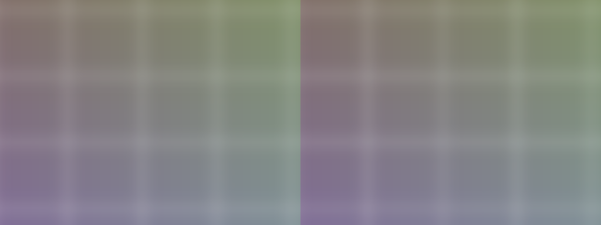

# 保留完整毛玻璃的 Windows 渲染研究

2026-09-08。用户明确要求背景效果必须保留。此前二值 alpha 背景静音实验已撤回，详见[归档与恢复](../binary-alpha-backdrop/README.md)。本轮只新增独立离屏诊断工具，没有替换产品的模糊模式、半径、背景采样或合成节点。

## 官方资料与代码核对

1. 当前 `SparsePrototypeBlur` 使用 GaussianBlur，sigma=12、BALANCED、HARD。微软说明 BALANCED 已使用内部预缩放，与 SPEED 的优化阈值相同，主要区别是三线性与线性过滤。直接降采样再模糊不能被当作一项尚未存在的优化；重复降采样可能降低画质。[Gaussian blur 官方说明](https://learn.microsoft.com/en-us/windows/win32/direct2d/gaussian-blur)
2. Direct2D 自动分析并链接兼容的效果 shader。高斯模糊需要多点采样，无法把其输入前的所有操作都融合成一次采样。当前使用内置 blur、affine transform、SourceIn 效果图；不能仅凭这张图就声称 DWM 实际只执行一个 pass。[Effect Shader Linking](https://learn.microsoft.com/en-us/windows/win32/direct2d/effect-shader-linking)
3. Windows Composition 的效果图由系统编译，不允许直接指定自定义 shader。因此自写 compute blur 并不是替换当前类中一个函数：还需要正确取得背景纹理、处理窗口遮挡与坐标、接入同步和合成。当前没有完成这条替代链路。[CompositionEffectBrush](https://learn.microsoft.com/en-us/uwp/api/windows.ui.composition.compositioneffectbrush?view=winrt-26100)
4. 微软建议复用 bitmap/brush，减少资源重建和不必要 Flush。当前稀疏场景已缓存效果工厂、brush 和节点，通常只替换共享表面；要进一步优化应量出真正发生的重建、失效与 GPU 重算。静态背景缓存只有在背景未变时才成立，前景视频和背后的本地窗口必须分别考虑更新。[Direct2D 性能指南](https://learn.microsoft.com/en-us/windows/win32/direct2d/improving-direct2d-performance)

## Windows 原生 GPU 实验

新增 [windows_blur_kernel_probe.cpp](../../../../tools/windows_blur_kernel_probe.cpp)，在现有 Windows Intel 硬件适配器上运行。3840×2160 BGRA，不创建窗口、不注入输入、不抓取桌面。绘制相同的密集条纹、细线和渐变，sigma=12、HARD 始终相同。测试顺序 BALANCED/SPEED/QUALITY/QUALITY/SPEED/BALANCED，每段 70 次，固定排除前 10 次预热，每模式 120 个统计样本。

每次 `SetInput(..., TRUE)` 使效果输入失效，`CACHED=FALSE`；避免把静态缓存命中当成重算性能。绑定同一内容仅用于隔离算法差异，不模拟动态 HostBackdrop。GPU timestamp 覆盖 Clear + DrawImage + EndDraw 所发出的 GPU 工作；不含输入上传和截图读回。每样本排空查询，不能作为实际异步流水线吞吐测试。[SetInput 失效参数](https://learn.microsoft.com/en-us/windows/win32/api/d2d1_1/nf-d2d1_1-id2d1effect-setinput)

| 模式 | GPU 中位 ms | P95 ms | 相对 BALANCED 最大 RGB 差异 | 平均 RGB 差异 |
|---|---:|---:|---:|---:|
| BALANCED（当前） | 3.382 | 3.408 | 0 | 0 |
| SPEED | 3.083 | 3.099 | 8 / 255 | 0.462 / 255 |
| QUALITY | 7.501 | 7.520 | 3 / 255 | 0.231 / 255 |

SPEED 仅减少约 0.300 ms（8.9%），有 393,301 个 RGB 通道误差超过 2；本轮不采用它作为产品优化。QUALITY 的比较也不等于连续高斯的数学真值。本图案不能代表所有桌面内容。

420 个原始样本全部频率有效、disjoint=false；原生进程 exit=0，结束后该探针进程为 0。本轮没有改变任何进程或线程优先级。状态文件中的 `Get-Process esrv` 记录的是 esrv 进程，不能作为此前受控的 esrv_svc 服务线程优先级证明；两者须分别核验。[原始时间戳](glass-kernel.csv)、[分段统计和像素比较](summary.json)、[运行身份](state.json)、[原生构建日志](build.log)。

左 BALANCED、右 SPEED，相同中心区域，原尺寸裁剪：

三张完整无损输出：[BALANCED](balanced.png)、[SPEED](speed.png)、[QUALITY](quality.png)。原始 BGRA 按行紧密保存并 gzip 压缩，尺寸与字节顺序写在工具中。不是对远程桌面内容的截图。

## 结论与下一步

保留现有 BALANCED 与完整毛玻璃。此次算法模式调整的收益不足以解释此前数毫秒至一帧的显示延迟，也没有测到 HostBackdrop 取样、DWM 内部工作或最终显示；不能从 3.38 ms 推导整条链路已经达到 4K60 / 33.33 ms。

下一步应直接测完整背景开启条件下的效果图失效和合成调度，重点验证前景 atlas 每帧更新是否重复触发本来未变的背景工作，再研究可复用的背景结果。任何缓存必须随背景窗口移动、内容更新、缩放与 alpha 更新正确失效，不能把背景冻结当作优化。减少每个 patch 的独立模糊图也是候选，但必须先检查采样边缘：此前改动模糊坐标空间曾产生像素差异，不能跳过原生图像对照。

可复现构建命令保存在 [build.cmd](method/build.cmd)，需要 Windows SDK、MSVC 及 C++/WinRT 头文件。`viewflow_blur_kernel_probe.exe <输出前缀>` 执行离屏实验；[native-probe.py](method/native-probe.py)是本次主机上传/构建/运行脚本，重用时需改主机与隔离路径。从归档运行 `python method/analyze.py` 可重建统计和 PNG，依赖 NumPy、Pillow。工具源和 SHA 清单一并保留。
